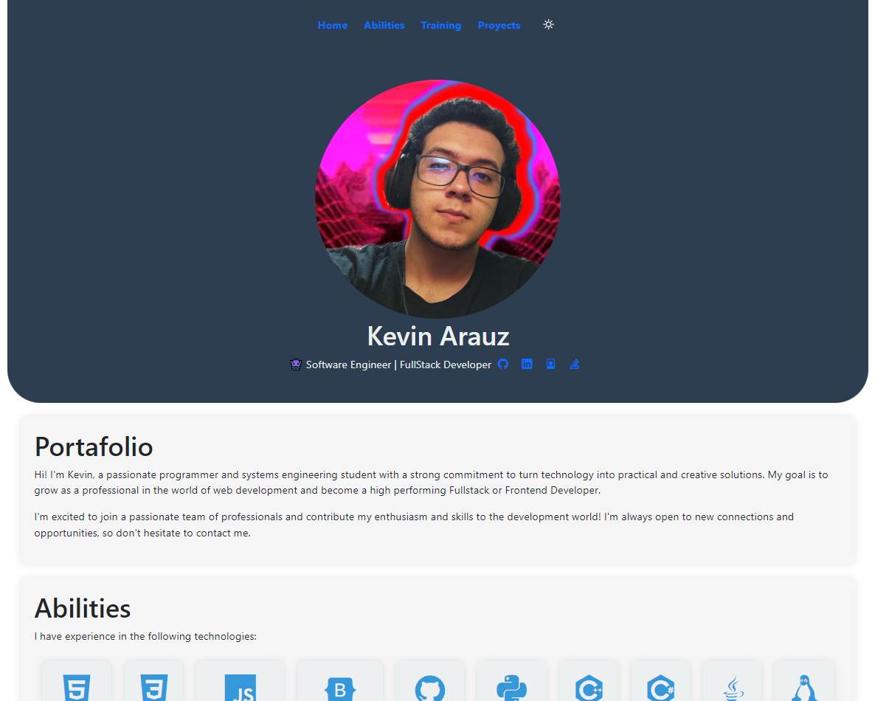

# My Portfolio

Welcome to my personal portfolio! This project showcases my skills, projects, and experience. It is built using HTML, CSS, and JavaScript.

## Introduction

Hi there! I'm Kevin Arauz, a passionate Software Engineer and FullStack Developer. I'm currently pursuing a degree in Information Systems Engineering. This repository serves as my portfolio to showcase my skills, projects, and accomplishments.

## Table of Contents
- [Demo](#demo)
- [Features](#features)
- [Introduction](#introduction)
- [Abilities](#abilities)
- [Contact](#contact)

## Demo

You can check out the live demo of the portfolio [here](https://kjarj54.github.io/Portafolio).

## Features

- **Responsive Design:** Ensuring a seamless experience across different devices and screen sizes.
- **Project Showcase:** Explore a curated selection of my projects, each with a detailed overview, technologies used, and project links.
- **About Me Section:** Get to know me better! Discover my background, skills, and passion for software development.
- **Contact Information:** Reach out to me easily through the provided contact information.

## Contact

Feel free to reach out to me through email:

- Email: kjarj14@gmail.com

---

Thank you for visiting my portfolio! 👾